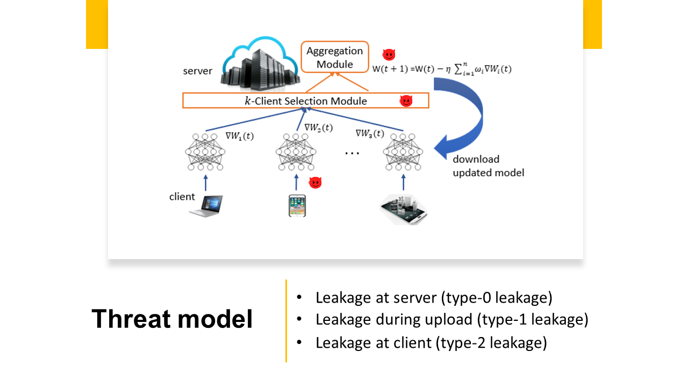
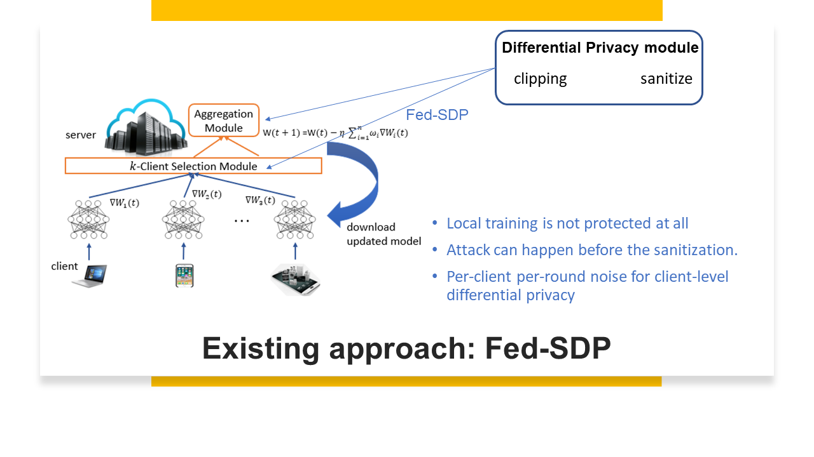
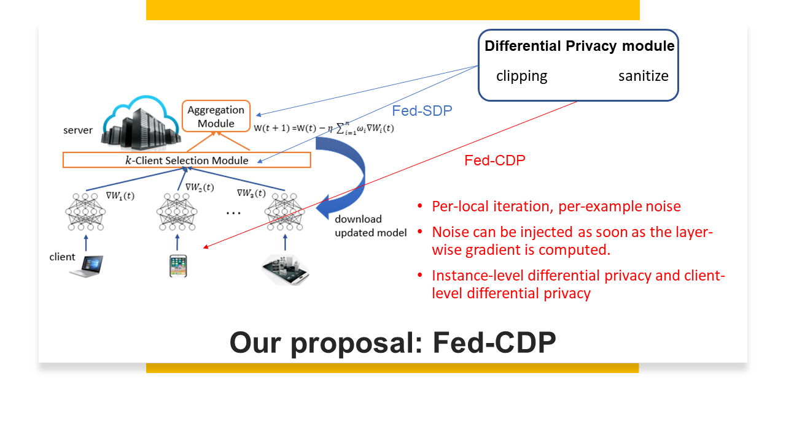

# Fed-CDP: Gradient Leakage Resilient Federated Learning


## description

This is the code for differentially private federated learning ([our paper](https://ieeexplore.ieee.org/abstract/document/9546481)) that is resilient to gradient privacy leakage. For gradient leakage attack, check [CPL attack](https://link.springer.com/chapter/10.1007/978-3-030-58951-6_27)  and [attack code](https://github.com/git-disl/CPL_attack). An adaptation for centralized setting can be found ([our paper](https://ieeexplore.ieee.org/document/9666855)).


### Federated learning faces three types of gradient leakage threats basing on the place of leakage 




### Existing approaches for federated learning with differential privacy （coined as Fed-SDP） concerns only the client-level differential privacy with per-client per-round noise.



### Our approach for federated learning with differential privacy (refered to as Fed-CDP) retrospects the instance-level differential privacy guarantee with per-example per-local iteration noise. With some differential privacy properties, the instance-level differential privacy guarantee also ensures the client-level differential privacy in federated learning.




## how to run

- First install the conda environment with environment.yml.

- Then run create_FLdistribution.sh to create a client distribution first (each client has two shards). The distribution file xxx_1000_clients.pkl would appear in the client folder and you may run the rest.

- <strong>FedSDP.py</strong> contains the code for training a benign and existing differentially private federated learning model (McMahan, H. Brendan, Daniel Ramage, Kunal Talwar, and Li Zhang. "Learning differentially private recurrent language models." arXiv preprint arXiv:1710.06963 (2017).). In this differentially private model, we consider Fed-SDP which adds per-client per-round noise, and only holds client level differential privacy. 

-  <strong>FedCDP.py</strong> contains the proposed Fed-CDP approach which adds per-example per-local iteration noise, instance level differential privacy. Due to the composition theorem, the instance-level noise provide both example-level and client-level differential privacy. 

- <strong>privacy_accounting_fed_clientlevel.py</strong>  and <strong>privacy_accounting_fed_instancelevel.py</strong> are codes for computing epsilon privacy spending at client level (for Fed-SDP with sampling rate = #participating clients/#total clients) and at instance level (for Fed-CDP with sampling rate = batch size * # participating client / # global data). We consider five privacy accounting methods: base composition, advanced composition, optimal composition, zCDP and Moments accountant.

- For gradient leakage attacks, please refer to our [CPL attacks](https://git-disl.github.io/CPL_attack/).


If you are interested in our research, please cite:

```
@inproceedings{wei2020framework,
  title={A framework for evaluating client privacy leakages in federated learning},
  author={Wei, Wenqi and Liu, Ling and Loper, Margaret and Chow, Ka-Ho and Gursoy, Mehmet Emre and Truex, Stacey and Wu, Yanzhao},
  booktitle={European Symposium on Research in Computer Security},
  year={2020},
 publisher={Springer}
}

@inproceedings{wei2021gradient,
  title={Gradient-Leakage Resilient Federated Learning},
  author={Wei, Wenqi and Liu, Ling and Wu, Yanzhao and Su, Gong and Iyengar, Arun},
booktitle={International Conference on Distributed Computing Systems},
  year={2021},
 publisher={IEEE}}

@article{wei2021gradient_tifs,
 title={Gradient Leakage Attack Resilient Deep Learning},  
 author={Wei, Wenqi and Liu, Ling},
  journal={Transactions on Information Forensics and Security},
  year={2021}，
 publisher={IEEE}}

}
```

Feel free to send me an email at wenqiwei66@gmail.com or wenqiwei@gatech.edu or raise an issue if you have any questions.


